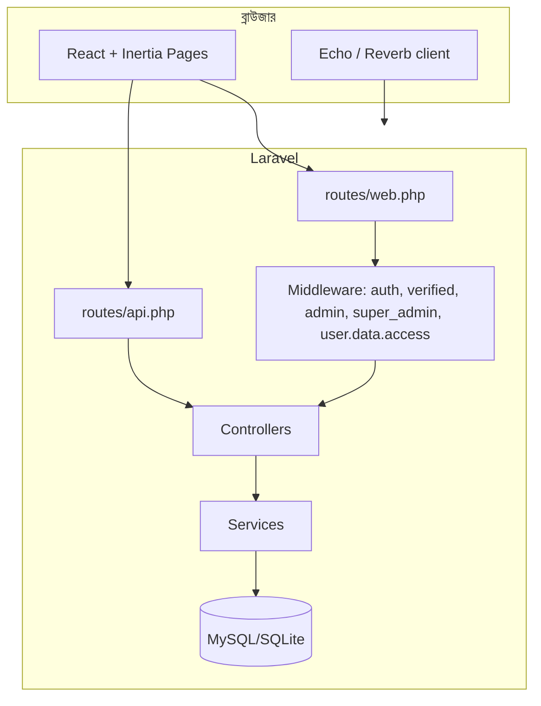

# ক্যাশ ম্যানেজমেন্ট অ্যাপ — সম্পূর্ণ ব্লুপ্রিন্ট (বাংলা)

এই নথিটি রিপোজিটরির **বর্তমান কোডবেস** থেকে তৈরি। উদ্দেশ্য: ফিচার, কোর আর্কিটেকচার, ডাটা মডেল, রাউট, অ্যাডমিন, API, কনফিগ ও টুলিং — যতটা সম্ভব **কিছু বাদ না রেখে** এক জায়গায় ম্যাপ করা।

---

## ১. সংক্ষিপ্ত পরিচিতি

এটি একটি **ব্যক্তিগত/ছোট ব্যবসার নগদ ও লেনদেন ব্যবস্থাপনা** ওয়েব অ্যাপ্লিকেশন। ব্যাকএন্ড **Laravel 12 (PHP 8.2+)**; ফ্রন্টএন্ড **Inertia.js + React 19 + TypeScript + Vite 7 + Tailwind CSS 4**। রিয়েলটাইম নোটিফিকেশনের জন্য **Laravel Reverb + Echo** ব্যবহারের উপযোগী কনফিগ ও চ্যানেল রয়েছে।

---

## ২. প্রযুক্তি স্ট্যাক (কোর)

| স্তর | প্রযুক্তি |
|------|-----------|
| ফ্রেমওয়ার্ক | Laravel 12 |
| UI ব্রিজ | Inertia Laravel 2 |
| ফ্রন্টএন্ড | React 19, TypeScript |
| বিল্ড | Vite 7, laravel-vite-plugin, @vitejs/plugin-legacy |
| স্টাইল | Tailwind CSS 4 |
| রাউট JS | Ziggy (tightenco/ziggy) |
| রিয়েলটাইম | laravel/reverb, Laravel Echo, @laravel/echo-react |
| চার্ট/এক্সপোর্ট | Chart.js, react-chartjs-2, xlsx, jspdf, html2canvas |
| UI কম্পোনেন্ট | Radix UI, Headless UI, Heroicons, Lucide |
| টেস্ট | Pest PHP |
| কিউ (ডেভ) | queue:listen (composer `dev` স্ক্রিপ্টে) |

---

## ৩. উচ্চস্তরের আর্কিটেকচার

- **Inertia**: সার্ভার Laravel কন্ট্রোলার থেকে পেজ প্রপস পাঠায়; SPA-সদৃশ নেভিগেশন, কিন্তু রাউটিং সার্ভার-সাইড।
- **`/api/*` (web.php-এর গ্রুপ)**: সেশন/ওয়েব স্ট্যাকের সাথে JSON API (CSRF সহ); **`routes/api.php`**: আলাদা API প্রিফিক্সযুক্ত স্টেটলেস-স্টাইল এন্ডপয়েন্ট (দুটোতেই একই কন্ট্রোলার মিরর)।
- **Broadcasting**: `Broadcast::routes` — `web` + `auth`। চ্যানেল: `routes/channels.php`।

---

## ৪. ব্যবহারকারী ভূমিকা ও অনুমতি (কোর মডেল)

`User` মডেলে **`role`** (যেমন সাধারণ ব্যবহারকারী, `admin`, `super_admin`) এবং **`permissions`** (JSON অ্যারে)।

মিডলওয়্যার:

- **`admin`**: শুধু অ্যাডমিন/সুপার অ্যাডমিন (`AdminMiddleware`)।
- **`super_admin`**: শুধু সুপার অ্যাডমিন (`SuperAdminMiddleware`) — ব্যাকআপ/কিছু সুপার-অ্যাডমিন রুট।
- **`user.data.access`**: অন্য ব্যবহারকারীর ডাটা URL দিয়ে অ্যাক্সেস ঠেকানো (`UserDataAccessMiddleware`)।
- **`auth` + `verified`**: ইমেইল ভেরিফাইড লগইন।

`User` মডেলে সাহায্যকারী মেথডের উদাহরণ (অনুমতি চেক): `canManageUsers`, `canViewAnalytics`, `canViewAllTransactions`, `canManageCategories`, `canManageSystemSettings`, `canViewSystemLogs`, `canExportData`, ইত্যাদি — এগুলো **অ্যাডমিন UI ও অপারেশন** গেট করতে ব্যবহৃত হয়।

---

## ৫. মূল ব্যবহারকারী ফিচার (নন-অ্যাডমিন)

### ৫.১ পাবলিক মার্কেটিং পেজ

| রাউট | উদ্দেশ্য |
|-------|---------|
| `GET /` | `welcome`-এ রিডাইরেক্ট |
| `GET /welcome` | ল্যান্ডিং (Inertia: `Welcome`) |
| `GET /features` | ফিচার পেজ |
| `GET /about` | অ্যাবাউট |
| `GET /health` | JSON হেলথ চেক |
| `GET /up` | Laravel ডিফল্ট হেলথ (bootstrap) |

### ৫.২ প্রমাণীকরণ (Auth)

- রেজিস্ট্রেশন, লগইন, লগআউট।
- পাসওয়ার্ড রিসেট (ইমেইল লিংক + টোকেন)।
- ইমেইল ভেরিফিকেশন (`verify-email`, সাইন্ড লিংক)।
- সেনসিটিভ অ্যাকশনের জন্য **কনফার্ম পাসওয়ার্ড**।

কন্ট্রোলার: `AuthenticatedSessionController`, `RegisteredUserController`, `PasswordResetLinkController`, `NewPasswordController`, `EmailVerification*`, `VerifyEmailController`, `ConfirmablePasswordController`।

### ৫.৩ ড্যাশবোর্ড ও লেজার

- **`GET /dashboard`**: সারাংশ/ড্যাশবোর্ড (`DashboardController`।
- **`GET /ledger`**: লেনদেন লেজার ভিউ (`TransactionController@ledger`)।

### ৫.৪ লেনদেন (Transactions)

**টাইপ (সিডার অনুযায়ী `transaction_types`):**

- `income` (incoming), `expense` (outgoing)
- `payable`, `receivable`
- `settlement` (neutral)
- `settle_receivable`, `settle_payable`

**রাউট গ্রুপ** `transactions.*` (প্রিফিক্স `/transactions`):

- তালিকা, তৈরি, সংরক্ষণ, দেখানো, সম্পাদনা, মুছে ফেলা।
- টাইপ-নির্দিষ্ট ফর্ম পেজ: `add-income`, `add-expense`, `add-receivable`, `add-payable`।
- **`POST .../settle`**: পাওনা/দেনা নিষ্পত্তি (`settle`)।

**লেগাসি রাউট** (পিছনের লিংক সামঞ্জস্য): `transaction`, `add-transaction` রিডাইরেক্ট; `transaction/{id}`, `transaction/{id}/edit`, `transaction/{id}` DELETE।

ভ্যালিডেশন: `StoreTransactionRequest`, `UpdateTransactionRequest`।

### ৫.৫ ক্যাটাগরি (Categories)

- `GET /categories` — তালিকা।
- `POST`, `PUT`, `DELETE` — CRUD (ইনডেক্স ভিত্তিক UI)।

মডেল: `Category` — `Transaction`-এর সাথে সম্পর্ক।

### ৫.৬ ইন-অ্যাপ নোটিফিকেশন

- **`GET /notifications`**: Inertia পেজ `notifications`।
- JSON API: `web.php`-এর `Route::prefix('api')` গ্রুপে `notifications.*` (লিস্ট, unread count, mark read, mark all read, **clear all**, delete)।
- `api.php`-এও আংশিক মিরর (clear-all ছাড়া)।

ইভেন্ট: `NotificationSent`, `NotificationRead`, `NotificationDeleted`।

### ৫.৭ সেটিংস

| এরিয়া | রাউট প্যাটার্ন | কন্ট্রোলার |
|--------|----------------|------------|
| প্রোফাইল | `settings/profile` | `ProfileController` — আপডেট, অ্যাকাউন্ট ডিলিট, **একাধিক প্রোফাইল ফото**, বর্তমান ফোটো সেট, আপলোড টেস্ট |
| পাসওয়ার্ড | `settings/password` | `PasswordController` |
| চেহারা (থিম/মোড) | `settings/appearance` | `AppearanceController` — আপডেট, mode, theme পোস্ট |
| মুদ্রা | `settings/currency` | `CurrencyController` — আপডেট, লাইভ রেট |
| এক্সচেঞ্জ রেট | `settings/exchange-rate` | `ExchangeRateController` — আপডেট, ডিলিট, টেস্ট |

মিডলওয়্যার: `HandleAppearance` (কুকি `appearance`, `sidebar_state` এনক্রিপশন বাদ)।

### ৫.৮ এক্সচেঞ্জ রেট API (পাবলিক + অথেন্টিকেটেড)

`web.php` ও `api.php` উভয়ে `exchange-rates` প্রিফিক্স:

- পাবলিক: বর্তমান রেট, নির্দিষ্ট রেট, সাপোর্টেড মুদ্রা, কনভার্ট।
- লগইন পর: সিঙ্ক, পুরনো রেট ক্লিয়ার, DB স্ট্যাটাস।

কন্ট্রোলার: `App\Http\Controllers\Api\ExchangeRateController`।

### ৫.৯ হোম রিডাইরেক্ট

- `GET /home` (অথেন্টিকেটেড গ্রুপে): ড্যাশবোর্ডে রিডাইরেক্ট।

---

## ৬. অ্যাডমিন ফিচার (`/admin/*`)

মিডলওয়্যার: `auth`, `admin`। নাম: `admin.*`।

| মডিউল | রাউট প্রিফিক্স | মূল কাজ |
|--------|----------------|----------|
| ড্যাশবোর্ড | `admin/dashboard` | অ্যাডমিন হোম |
| অ্যানালিটিক্স | `admin/analytics` | চার্ট/পরিসংখ্যান ভিউ |
| সিস্টেম সেটিংস | `admin/system-settings` | জেনারেল, ইমেইল, ডাটাবেস, সিকিউরিটি আপডেট |
| সিস্টেম হেলথ | `admin/system-health` | স্বাস্থ্য/স্ট্যাটাস |
| ইউজার ম্যানেজমেন্ট | `admin/users` | CRUD, স্ট্যাটাস টগল, পাসওয়ার্ড রিসেট |
| রোল ও পারমিশন | `admin/role-permission` | রোল/পারমিশন আপডেট, বাল্ক, এক্সপোর্ট |
| অ্যাডমিন নোটিফিকেশন | `admin/notifications` | তালিকা, ডিটেইল, মুছে ফেলা, সব পঠিত |
| অ্যাক্টিভিটি লগ | `admin/activity-logs` | তালিকা, ডিটেইল, এক্সপোর্ট, ক্লিয়ার |
| সিস্টেম অডিট | `admin/system-audit` | অডিট ভিউ + এক্সপোর্ট |
| ডাটাবেস | `admin/database` | অপটিমাইজ, রিপেয়ার, স্ট্যাটাস |

কন্ট্রোলার: `AdminDashboardController`, `AdminAnalyticsController`, `SystemSettingsController`, `SystemHealthController`, `UserManagementController`, `RolePermissionController`, `Admin\NotificationController`, `ActivityLogController`, `SystemAuditController`, `DatabaseManagementController`।

---

## ৭. সুপার অ্যাডমিন ফিচার

মিডলওয়্যার: `super_admin`।

### ৭.১ `admin/super-admin/*`

- সুপার অ্যাডমিন ইনডেক্স।
- ব্যবহারকারী **promote/demote** সুপার অ্যাডমিন।
- সুপার অ্যাডমিন **permissions** আপডেট।
- সিস্টেম অডিট ও অ্যাক্টিভিটি লগ ভিউ (নির্দিষ্ট রুট)।
- আলাদা সিস্টেম হেলথ ভিউ।

কন্ট্রোলার: `SuperAdminController`।

### ৭.২ ব্যাকআপ ও রিস্টোর (`admin/backup/*`)

- তালিকা, তৈরি, রিস্টোর, ডাউনলোড, ডিলিট।

কন্ট্রোলার: `BackupRestoreController`।

---

## ৮. ডাটা মডেল (ডাটাবেস কোর)

### ৮.১ টেবিল ও মাইগ্রেশন (প্রধান)

- **users** — ব্যবহারকারী, রোল, পারমিশন, মুদ্রা/থিম/অ্যাপিয়েন্স, প্রোফাইল ফোটো কলাম ইত্যাদি (একাধিক alter মাইগ্রেশন)।
- **sessions**, **password_reset_tokens** — Laravel স্ট্যান্ডার্ড।
- **cache**, **jobs**, **failed_jobs** — ক্যাশ/কিউ।
- **profile_photos** — একাধিক প্রোফাইল ছবি।
- **categories** — লেনদেন ক্যাটাগরি।
- **transaction_types** — লেনদেন টাইপ।
- **transactions** — পরিমাণ, টাইপ, ক্যাটাগরি, ইউজার, সেটেলমেন্ট মেটাডেটা, `metadata` JSON, সম্পর্কিত ট্রানজাকশন ইত্যাদি।
- **exchange_rates** — মুদ্রা জোড়া ও রেট।
- **notifications** — ইন-অ্যাপ নোটিফিকেশন।
- **activity_logs** — অ্যাক্টিভিটি/অডিট লগ (`properties` JSON)।

### ৮.২ মডেল ও সম্পর্ক (সংক্ষেপ)

| মডেল | সম্পর্ক / নোট |
|-------|----------------|
| User | transactions, notifications, profilePhotos; `isAdmin`, `isSuperAdmin`, `hasPermission` |
| Transaction | user, category, transactionType, relatedTransaction, settlements |
| Category | transactions |
| TransactionType | transactions; direction স্কোপ |
| ExchangeRate | স্ট্যাটিক হেল্পার `getRate`, `updateRate`, `cleanOldRates` |
| Notification | user; ইভেন্ট ফায়ার |
| ActivityLog | user; polymorphic-সদৃশ টার্গেট |
| ProfilePhoto | user, `is_current` |

### ৮.৩ ফ্যাক্টরি ও সিডার

- **Factories**: `UserFactory`, `CategoryFactory`, `TransactionFactory`।
- **Seeders**: `DatabaseSeeder` → `SuperAdminSeeder`, `SettlementCategorySeeder`, `TransactionTypeSeeder` (`TransactionSeeder` ডিফল্টে বন্ধ)।
- **AdminSeeder** ফাইল আছে (প্রয়োজনে ম্যানুয়াল কল)।

---

## ৯. সার্ভিস লেয়ার (বিজনেস লজিক কোর)

`app/Services/`:

- **TransactionService** — লেনদেন অপারেশন।
- **SettlementService** — নিষ্পত্তি।
- **FinancialConstraintService** — আর্থিক সীমা/সতর্কতা।
- **ExchangeRateService** — রেট ফেচ/সিঙ্ক।
- **EnvironmentDetectionService** — পরিবেশ শনাক্তকরণ।
- **AdminNotificationService** — অ্যাডমিন নোটিফিকেশন।
- **ActivityLogService** — লগ রাইটিং/কোয়েরি।

---

## ১০. ফর্ম রিকোয়েস্ট, ইভেন্ট, নোটিফিকেশন

- **Form requests**: `StoreTransactionRequest`, `UpdateTransactionRequest`, `LoginRequest`, `ProfileUpdateRequest`, `UpdateAppearanceRequest`, `UpdateCurrencyRequest`, `UpdateExchangeRateRequest`।
- **Events**: `NotificationSent`, `NotificationRead`, `NotificationDeleted`।
- **Mail notification**: `ResetPasswordNotification`।
- **Policies / Jobs / Listeners**: `app/Policies`, `app/Jobs`, `app/Listeners` — খালি বা ন্যূনতম (কোডবেস অনুযায়ী)।

---

## ১১. ফ্রন্টএন্ড কাঠামো (`resources/js`)

### ১১.১ এন্ট্রি

- `app.tsx` — মূল ক্লায়েন্ট।
- `ssr.tsx` — SSR (Vite কনফিগ অনুযায়ী)।

### ১১.২ পেজ (`pages/`)

- **পাবলিক**: `Welcome`, `Features`, `About`।
- **Auth**: `login`, `register`, `forgot-password`, `reset-password`, `verify-email`, `confirm-password`।
- **অ্যাপ**: `dashboard`, `ledger`, `transaction`, `transaction-view`, `transaction-edit`, `add-transaction`, `categories`, `notifications`।
- **লেনদেন টাইপ**: `transactions/add-income`, `add-expense`, `add-receivable`, `add-payable`।
- **সেটিংস**: `settings/profile`, `password`, `appearance`, `currency`, `exchange-rate`।
- **অ্যাডমিন**: `admin/dashboard`, `analytics`, `system-settings`, `system-health`, `super-admin`, `user-management`, `user-profile`, `role-permission`, `notifications`, `notification-detail`, `activity-logs`, `activity-log-view`, `system-audit`, `database`, `backup`।

### ১১.৩ গুরুত্বপূর্ণ কম্পোনেন্ট ও কনটেক্সট

- **শেল**: `app-shell`, `app-sidebar`, `app-header`, `nav-main`, `nav-user`, `breadcrumbs`।
- **অ্যাডমিন**: `admin-route-guard`, `admin-notification`।
- **ডোমেইন**: `Transactions/TransactionTable`, `FinancialConstraintWarning`।
- **রিয়েলটাইম**: `contexts/RealTimeNotificationContext.tsx`।
- **UI**: `components/ui/*` (বাটন, ডায়ালগ, টেবিল, টোস্ট, সাইডবার ইত্যাদি)।

---

## ১২. ব্রডকাস্ট চ্যানেল (`routes/channels.php`)

- `user.{id}` — ব্যক্তিগত।
- `admin.notifications`, `super-admin.notifications`।
- `user.presence.{id}`, `admin.presence` — উপস্থিতি-সদৃশ।

---

## ১৩. কনফিগারেশন ফাইল (অ্যাপ-নির্দিষ্ট)

- **`config/installer.php`** — ইনস্টলার **ডিফল্ট** (অ্যাপ নাম, DB, ফিচার ফ্ল্যাগ, মুদ্রা, অ্যাডমিন সিড ক্রেডেনশিয়াল, PHP এক্সটেনশন চেক, ডিরেক্টরি পারমিশন)। **নোট**: বর্তমানে পূর্ণ ওয়েব-ভিত্তিক ইনস্টলার উইজার্ড রাউট কোডবেস সার্চে দেখা যায়নি; এটি মূলত **কনফিগ/ভবিষ্যৎ টুলিং**।
- **`config/environment.php`**, **`config/production.php`** — পরিবেশ ও প্রোডাকশন ডিফল্ট।
- **`config/inertia.php`**, **`config/reverb.php`**, **`config/broadcasting.php`** — Inertia ও রিয়েলটাইম।
- **`config/app.php`, `auth.php`, `database.php`, `mail.php`, `session.php`, `cache.php`** — Laravel স্ট্যান্ডার্ড।

---

## ১৪. Artisan কমান্ড (`app/Console/Commands`)

ডাটা মেরামত, পরিবেশ ও মেইল টেস্ট ইত্যাদি। উদাহরণ (নাম অনুযায়ী):

- `users:fix-profile-photos`, `profile-photos:cleanup`, `users:check-profile-photos`, `check:profile-photos`, `profile-photos:check`
- `transactions:fix-types`, `settlements:fix-amounts`
- `notifications:cleanup`
- `env:detect`, `env:config`
- `mail:test`
- `check:database`

`routes/console.php`-এ Laravel ডিফল্ট `inspire` কমান্ড।

---

## ১৫. টেস্ট (`tests/`)

- **Feature**: Auth (রেজিস্ট্রেশন, লগইন, ইমেইল ভেরিফিকেশন, পাসওয়ার্ড রিসেট, কনফার্ম), ড্যাশবোর্ড, সেটিংস (প্রোফাইল/পাসওয়ার্ড)।
- **Unit**: `TransactionServiceTest`, `ExampleTest`।

---

## ১৬. ডেভেলপমেন্ট ও বিল্ড (`package.json` / `composer.json`)

- **`npm run dev`** — Vite।
- **`npm run build`**, **`build:production`**, **`build:deploy`** (Windows-ফোকাসড `public/build` কপি)।
- **`npm run build:ssr`** — SSR বিল্ড।
- **`composer run dev`** — `php artisan serve` + `queue:listen` + `npm run dev` (concurrently)।
- **`composer test`** — `php artisan test`।

---

## ১৭. ফলব্যাক ও নিরাপত্তা নোট

- **`Route::fallback`** — অজানা URL `home`-এ রিডাইরেক্ট।
- **CSRF**: ওয়েব গ্রুপে `ValidateCsrfToken`।
- **থ্রটলিং**: ভেরিফিকেশন ও কনফার্ম পাসওয়ার্ড রুটে।
- **`TestController`**: স্টাব; রাউটে লিংক নেই।

---

## ১৮. ফাইল মানচিত্র (দ্রুত রেফারেন্স)

| এলাকা | পাথ |
|--------|------|
| ওয়েব রাউট | `routes/web.php` |
| API রাউট | `routes/api.php` |
| চ্যানেল | `routes/channels.php` |
| মিডলওয়্যার | `app/Http/Middleware/` |
| কন্ট্রোলার | `app/Http/Controllers/` |
| মডেল | `app/Models/` |
| সার্ভিস | `app/Services/` |
| মাইগ্রেশন | `database/migrations/` |
| সিডার | `database/seeders/` |
| Inertia পেজ | `resources/js/pages/` |
| কম্পোনেন্ট | `resources/js/components/` |
| ইনস্টলার কনফিগ | `config/installer.php` |

---

## ১৯. সারসংক্ষেপ চেকলিস্ট — “কি কি আছে”

- [x] পাবলিক ল্যান্ডিং + ফিচার/অ্যাবাউট  
- [x] সম্পূর্ণ Auth + ইমেইল ভেরিফিকেশন + পাসওয়ার্ড রিসেট  
- [x] ড্যাশবোর্ড, লেজার, লেনদেন CRUD  
- [x] আয়, ব্যয়, পাওনা, দেনা + সেটেলমেন্ট  
- [x] ক্যাটাগরি ব্যবস্থাপনা  
- [x] মাল্টি-কারেন্সি ও এক্সচেঞ্জ রেট (সেটিংস + API)  
- [x] প্রোফাইল, একাধিক ফোটো, পাসওয়ার্ড, থিম/অ্যাপিয়েন্স, মুদ্রা  
- [x] ইন-অ্যাপ নোটিফিকেশন + JSON API + (Reverb/Echo-রেডি) ব্রডকাস্ট চ্যানেল  
- [x] অ্যাডমিন: ড্যাশবোর্ড, অ্যানালিটিক্স, সেটিংস, হেলথ, ইউজার, রোল/পারমিশন, লগ, অডিট, DB টুল  
- [x] সুপার অ্যাডমিন: প্রমোশন, পারমিশন, ব্যাকআপ/রিস্টোর  
- [x] অ্যাক্টিভিটি লগ সার্ভিস ও অ্যাডমিন UI  
- [x] আর্থিক কনস্ট্রেইন্ট সার্ভিস (UI সতর্কতা কম্পোনেন্ট সহ)  
- [x] পরিবেশ ডিটেকশন ও `.env` টুলিং কমান্ড  
- [x] Pest টেস্ট, কিউ, SSR বিল্ড অপশন  
- [x] ইনস্টলার **কনফিগ** (`config/installer.php`) — পূর্ণ ইনস্টল UI রাউট কোডবেসে নয়  

---

*এই নথি জেনারেট করা হয়েছে রিপোজিটরি স্ক্যান থেকে। নতুন ফিচার যোগ হলে সংশ্লিষ্ট `routes/`, `app/`, `resources/js/pages/` আপডেট করে এই ফাইলও হালনাগাদ করা উচিত।*
